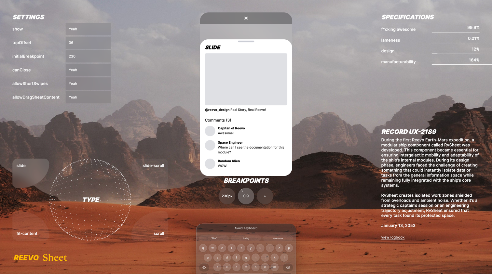
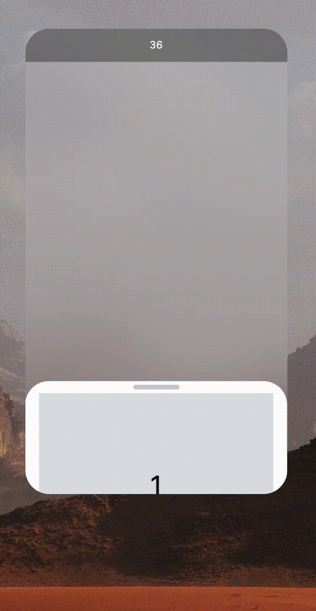
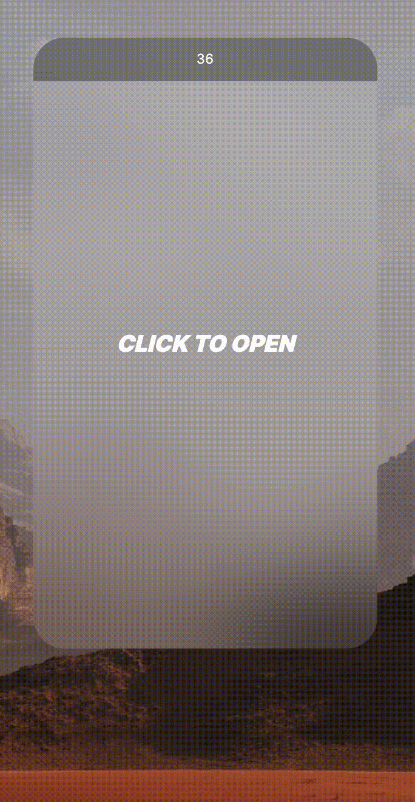

# Reevo Sheet Vue | Modern Touch-Friendly Modal for Vue.js



<p style="text-align: center">
  <strong>Reevo Sheet</strong> is a modern and highly customizable modal component designed for touch devices, utilizing <a href="https://developer.mozilla.org/en-US/docs/Web/API/Web_Animations_API" target="_blank">WAAPI</a> and pure JavaScript.
</p>

<div style="display: flex; gap: 10px; max-width: 100%">
  
  
  
  
</div>

<div style="display: flex; width: 100%; justify-content: center; padding: 24px 0;">
  <svg class="logo" viewBox="0 0 128 128" width="128" height="128" data-v-2b313a12=""><path fill="#42b883" d="M78.8,10L64,35.4L49.2,10H0l64,110l64-110C128,10,78.8,10,78.8,10z" data-v-2b313a12=""></path><path fill="#35495e" d="M78.8,10L64,35.4L49.2,10H25.6L64,76l38.4-66H78.8z" data-v-2b313a12=""></path></svg>
</div>

<p style="text-align: center">Explore how to use <strong>RvSheet</strong> with Vue.js in this comprehensive example repository.</p>

## 🚀 Features
- **Touch-Optimized**: Specifically designed for mobile and touch devices, ensuring seamless user interactions.
- **Smooth Animations**: Powered by WAAPI, offering one of the most efficient and smooth animation experiences available today.
- **Vue.js Integration**: Effortlessly integrates with Vue.js, making development faster and easier.
- **Framework-Agnostic**: Built with pure JavaScript, allowing you to use it with any framework of your choice.
- **Comprehensive Configuration**: Packed with all the essential props to meet your customization needs.
- **Full Control**: Offers complete flexibility over templates and styles, empowering you to create a fully customized user experience.

## 📦 Installation

Edit .npmrc and insert your token:

```
@reevo-design:registry=https://npm.pkg.github.com/
//npm.pkg.github.com/:_authToken=YOUR_TOKEN
```

Install with npm:

```bash
npm i @reevo-design/sheet
```

## 🛝 Playground

Experiment with RvSheet props in real time on our [interactive playground](https://reevo.design/modules/sheet)

## 📄 Documentation

Access the full Reevo Sheet [documentation](https://reevo.design/docs/sheet) to learn about all available features, configurations, and integration tips.

## 🪟 Vue.js template

Check out the Vue.js template example for RvSheet:
[View the template here](./src/components/rv-sheet.vue)
